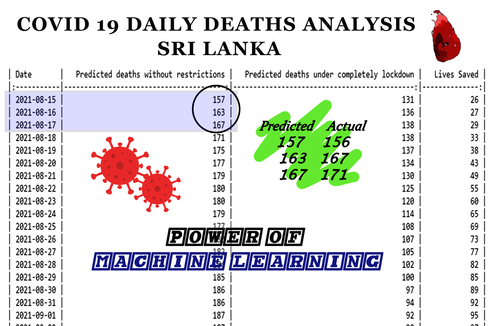

# COVID-19 OUTBREAK PREDICTOR (CONSIDERED BOTH UNRESTRICTED AND ISLAND-WIDE LOCKDOWN CONDITIONS)

The primary aim of this project is to make a reliable perdition model to
forecast the COVID-19 spread in the Sri Lankan populations and is to
estimate the future COVID-19 death cases at the end of each day.

RCNN models are designed to forecast both new cases and death counts. In
**addition, the model is designed to forecast the future of Sri Lanka with
entirely restricted conditions (Islandwide Lockdown).**

Compare the results of both models and convince the decision-makers of
the importance of sudden measures to flatten the covid curve.

There are 03 sections of the Notebook. First, the exploratory data
analysis section, followed by the building of neural network models to
predict the spread of the disease with the lifted covid 19 restrictions
(Current statutes) and finally, a model to forecast under an entire
lockdown state.

